# Work Wave 
 Сайт для поиска работы или работников, а также для размещения резюме или вакансий.
 
## Описание
Сайт обладает удобным и лаконичным интерфейсом, всё происходящее фиксируется в аккаунтах,
так что вы точно не забудете, кого вы позвали на вакансию, или на какую вакансию вы откликнулись.

## Схема
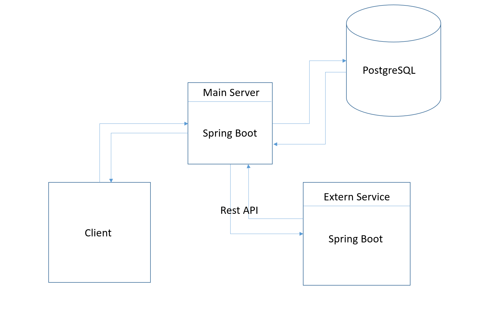

Приложение представляет собой два микро сервиса, один из них - основной, на нем происходит основная часть
работы приложения, и второй, который представляет собой также Spring Boot приложение, в нем происходит проверка
компании на корректность введённых данных, и в случае успешного прохождения проверок, компания, в лице сотрудника, 
имеет возможность зарегистрироваться. Используемая база данных - PostgreSQL.

## Схема базы данных
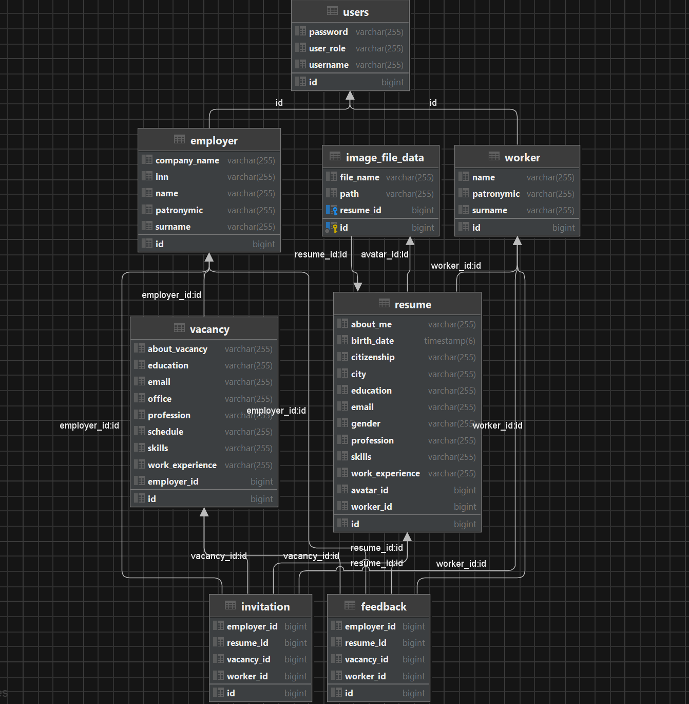

## Функционал

### Главные страницы, для работника и для работодателя:
#### Пример для работника
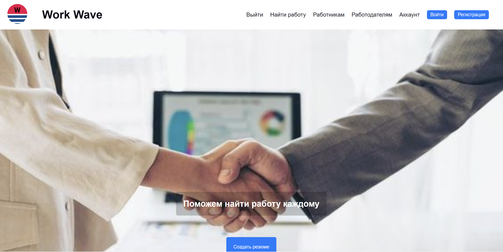  

### Общий логин для двух ролей работник и работодатель

### Регистрация для работника и для работодателя:

#### Пример для работодателя

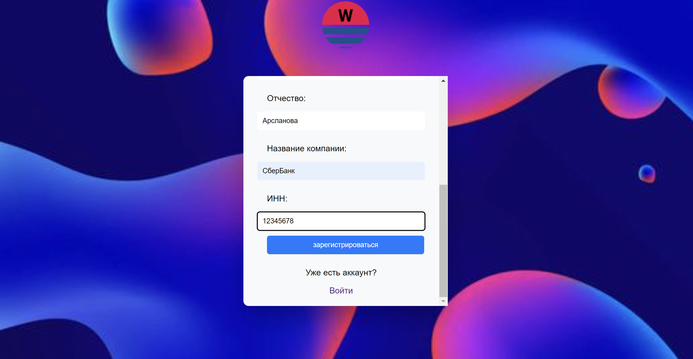

### Проверки при регистрации для работника и для работодателя соответственно:
#### Проверки уникальности логина, и проверка инн компании для работодателя, с использованием второго сервера

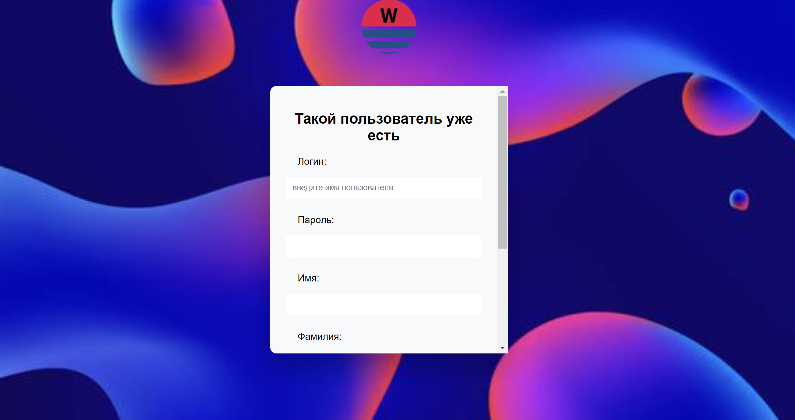 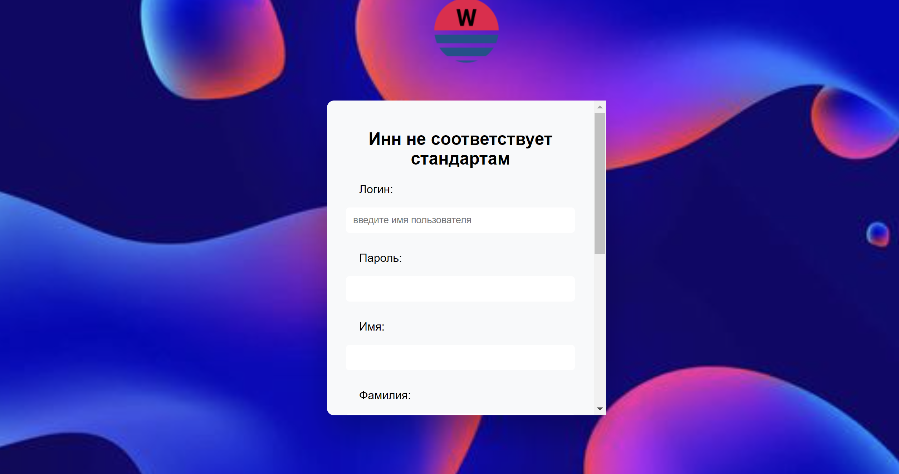

### Переход в аккаунт для работника и для работодателя:

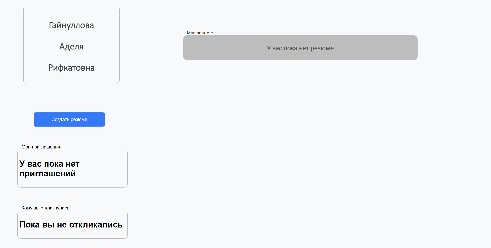

### Возможность создать резюме и добавить свои фотографию:

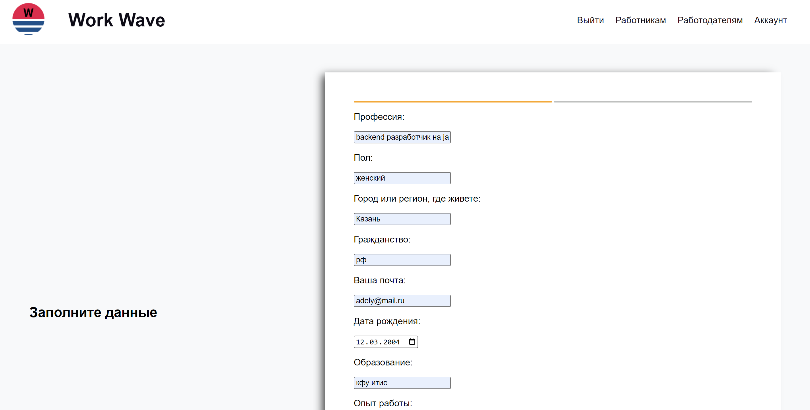 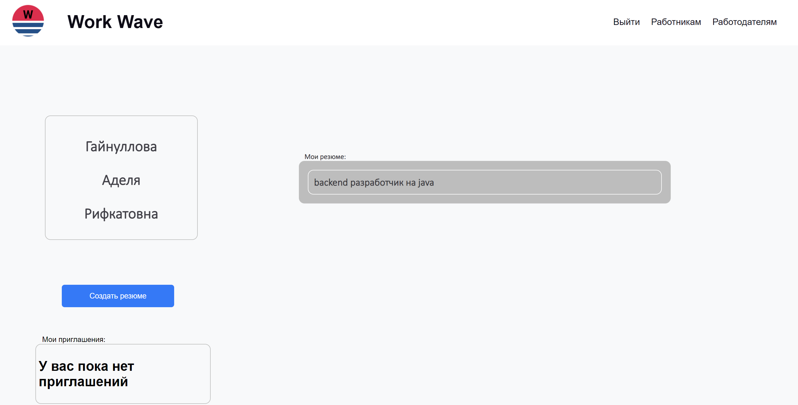

### А также возможность просмотреть своё резюме
##### Похожие возможности есть и у работодателя, он может создать вакансию и просмотреть её

### Также пользователи могут воспользоваться поиском

##### В данном случае пример поиска сотрудника по резюме для работодателя
 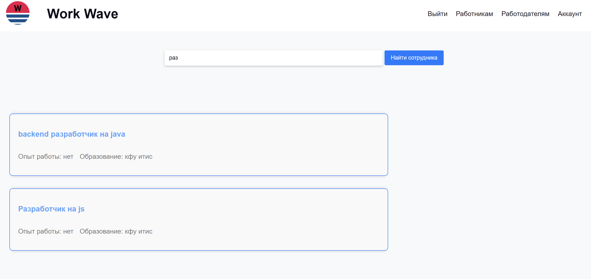 

#### Резюме можно будет посмотреть только если вы вошли как работодатель, иначе вас перебросит на логин

### Если вы вошли как работодатель, вы сможете пригласить работника на любые из ваших вакансий:

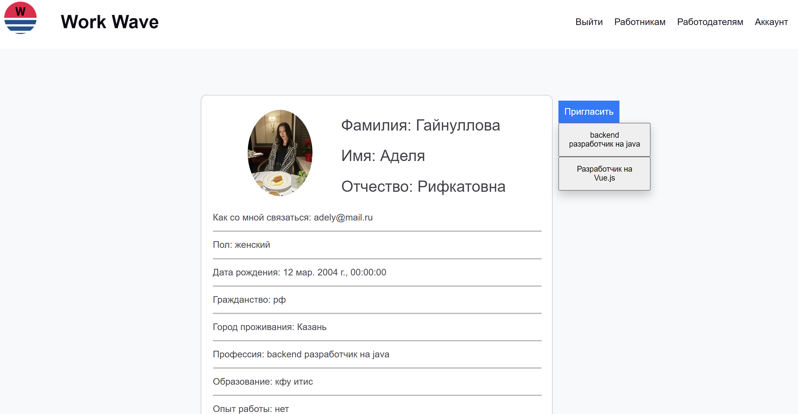

 При нажатии на свою вакансию, вы увидите надпись "отправили", автоматически произойдет сохранение результата,
 который вы и этот работник сможете наблюдать в своих аккаунтах, если же вы нажмете ещё раз,
 вам выйдет надпись "вы уже отправляли" и не добавит ещё раз эти данные.

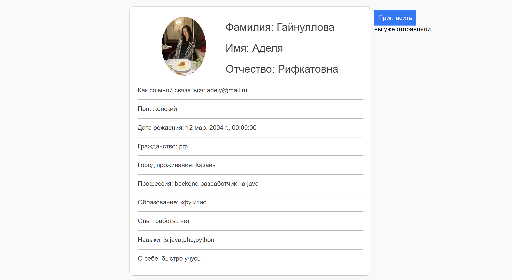

### Аналогичными правами обладает работник.